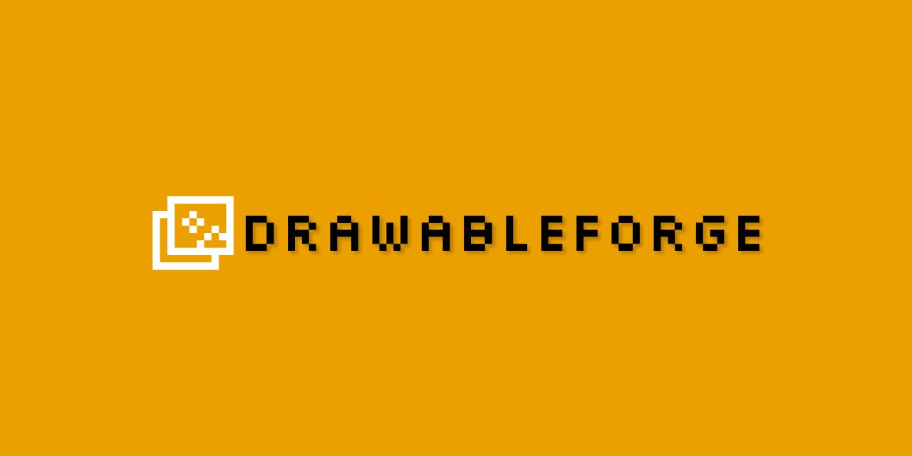
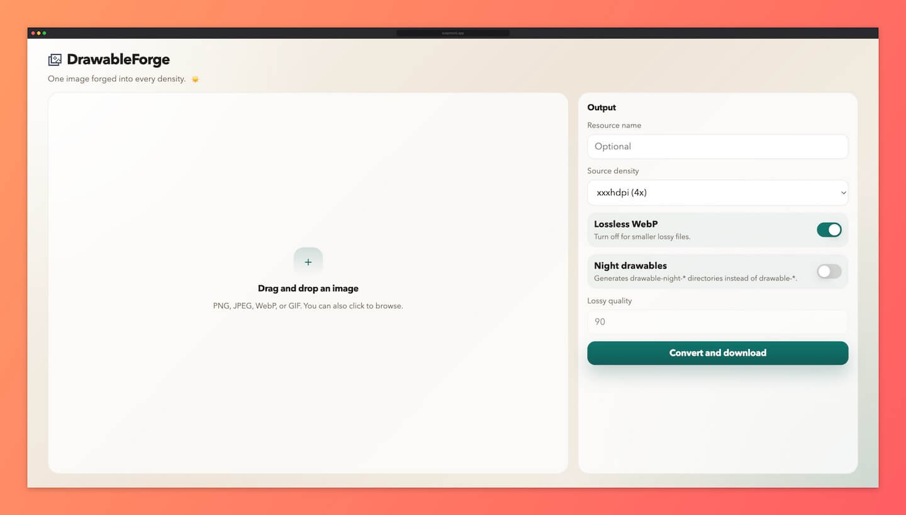

# DrawableForge

One image forged into every density.

Converts a single image into zipped Android WebP drawables for every density, from ldpi to xxxhdpi. Runs entirely in the browser. Nothing leaves your machine.

## Usage

1. Drop an image or click to browse.
2. Set a resource name if you want one. Otherwise the file name is used.
3. Pick the source density of your input image. Default is `xxxhdpi`. Everything else is derived from it.
4. Choose Lossless WebP (default) or switch to lossy and set quality (0-100, default 90).
5. Toggle Night drawables to get `drawable-night-*` instead of `drawable-*`.
6. Click Convert and download. You get `<resource>_drawables.zip` or `<resource>_night_drawables.zip`.

## Features

- All six Android density buckets from one image (ldpi, mdpi, hdpi, xhdpi, xxhdpi, xxxhdpi).
- Source density selector prevents incorrect upscaling of low-res inputs.
- Lossless WebP by default. Lossy with adjustable quality.
- Night drawables in one click (outputs `drawable-night-*` directories).
- 100% client-side. Nothing leaves your machine.

## Supported formats

PNG, JPEG, WebP, and GIF are supported via browser-native decoding. BMP and TIFF are not supported.

## Self-hosting

Static files only. Serve the repo root over HTTP or publish via GitHub Pages. No build step required.

## Developer docs

Architecture, tests, and the dev server: [`DEV.md`](DEV.md).

## Screenshot

## License

[Apache License 2.0](LICENSE)
